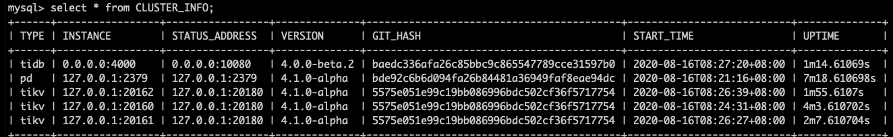
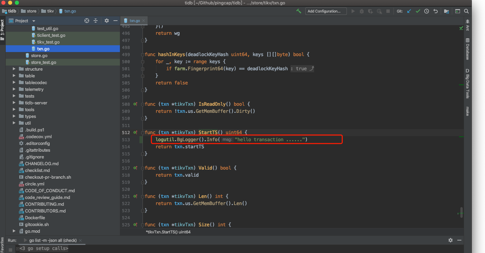
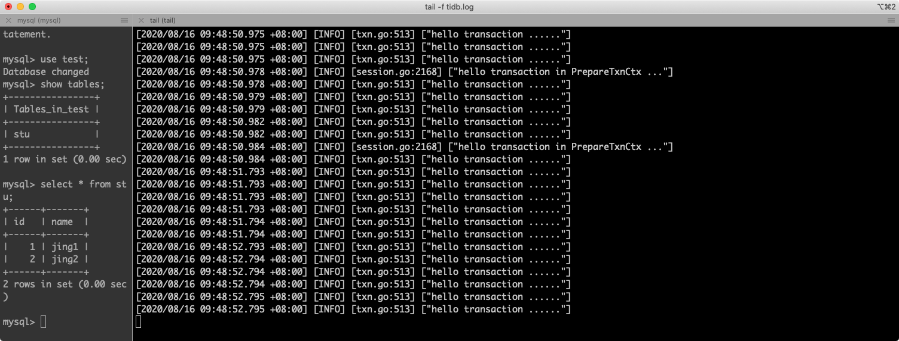

## 开发环境 
OS : mac 10.15.6
go : go1.15
rust : rustc 1.45.2 
cargo : 1.45.1

pd、tidb、tikv 编译代码均为**master分支**


## 集群环境

单节点部署集群


| Srvices |Host IP  | Port |
| --- | --- | --- |
| pd | 127.0.0.1 | 2379 |
| tikv | 127.0.0.1 | 20160 |
| tikv | 127.0.0.1 | 20161 |
| tikv | 127.0.0.1 | 20162 |
| tidb | 127.0.0.1 | 4000 |


启动pd

```bash
./pd-server --name=pd1 \
                  --data-dir=pd1 \
                  --client-urls="http://127.0.0.1:2379" \
                  --peer-urls="http://127.0.0.1:2380" \
                  --initial-cluster="pd1=http://127.0.0.1:2380" \
                  --log-file=pd.log
```
                
                
启动kv1

```bash
./tikv-server --pd="127.0.0.1:2379" \
                   --addr="127.0.0.1:20160" \
                   --data-dir=tikv1 \
                   --log-file=tikv.log
```
                   
启动kv2
```bash
 ./tikv-server --pd="127.0.0.1:2379" \
                   --addr="127.0.0.1:20161" \
                   --data-dir=tikv2 \
                   --log-file=tikv2.log
```


启动kv3

```bash
./tikv-server --pd="127.0.0.1:2379" \
                   --addr="127.0.0.1:20162" \
                   --data-dir=tikv3 \
                   --log-file=tikv3.log
```
               
 启动tidb
 
 ```bash
./tidb-server --store=tikv \
                   --path="127.0.0.1:2379" \
                   --log-file=tidb.log

```
                  
                  

通过mysql客户端查看
>mysql -h 127.0.0.1 -P 4000 -u root




## 添加事务日志






 
 
