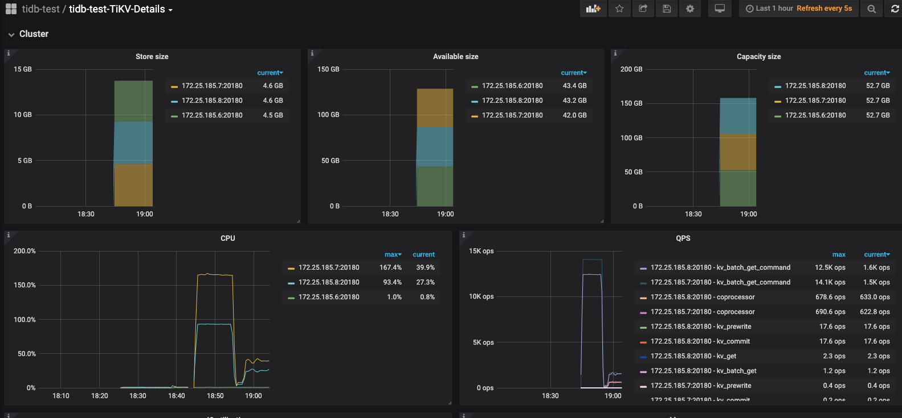

## 1.机器硬件配置

阿里云 ecs.c6.2xlarge

| 类别  | 名称                    |
| ----- | ----------------------- |
| OS    | linux / CentOS 7.5 64位 |
| CPU   | 8 vCPU                  |
| RAM   | 32GB                    |
| DISK  | 50GB                    |
| BRAND | 100 Mbps                |

## 2.集群信息

拓补信息

| 实例                     | 个数 | 物理机配置   | IP                                               | 配置                  |
| ------------------------ | ---- | ------------ | ------------------------------------------------ | --------------------- |
| TiDB                     | 3    | 8 vCPU 32 GB | 172.25.185.6、172.25.185.7、172.25.185.8（私网） | 默认端口 全局目录配置 |
| PD                       | 3    | 8 vCPU 32 GB | 172.25.185.6、172.25.185.7、172.25.185.8（私网） | 默认端口 全局目录配置 |
| TiKV                     | 3    | 8 vCPU 32 GB | 172.25.185.6、172.25.185.7、172.25.185.8（私网） | 默认端口 全局目录配置 |
| sysbench&&go-ycsb&go-tpc | 1    | 8 vCPU 16 GB | 172.25.185.12（私网）                            | 默认端口 全局目录配置 |
| Monitoring & Grafana     | 1    | 8 vCPU 32 GB | 172.25.185.7（私网）                             | 默认端口 全局目录配置 |

集群信息


## 3.TiDB 、TiKV调优配置及测试

tiup 集群基础配置

```yaml
global:
  user: "tidb"
  ssh_port: 22
  deploy_dir: "/tidb-deploy"
  data_dir: "/tidb-data"

pd_servers:
  - host: 172.25.185.7
  - host: 172.25.185.8
  - host: 172.25.185.6

tidb_servers:
  - host: 172.25.185.7
  - host: 172.25.185.8
  - host: 172.25.185.6

tikv_servers:
  - host: 172.25.185.7
  - host: 172.25.185.8
  - host: 172.25.185.6

monitoring_servers:
  - host: 172.25.185.7

grafana_servers:
  - host: 172.25.185.7

alertmanager_servers:
  - host: 172.25.185.7
```

配置调优：

 tikv配置调优

```
线程池相关：
1.Storage Read Pool 调整，读请求使用统一线程池，降低线程数量，readpool.storage.use-unified-pool=true（4.0及以后）
2.gRPC 线程池的大小调整，server.grpc-concurrency=2
3. 调整UnifyReadPool 的线程数，避免频繁的线程切换，treadpool.unified.max-thread-count = 4 (8 core)
4. Raftstore 写线程调整，raftstore.sync-log=false
其他：
 raftstore.sync-log: false
 storage.block-cache.capacity: "1GB"
 rocksdb.defaultcf.block-size: "64KB"
 rocksdb.defaultcf.write-buffer-size: "128MB"
 rocksdb.defaultcf.max-write-buffer-number: 10
 readpool.coprocessor.use-unified-pool: true
```

部署集群

> tiup cluster deploy tidb-test v4.0.0 ./topology.yaml --user root [-p] [-i /home/root/.ssh/gcp_rsa]

启动集群 

> tiup cluster start tidb-test

关闭集群

> tiup cluster stop tidb-test

验证集群运行状态

> tiup cluster display tidb-test

连接tidb

> mysql -u root -h 101.200.239.97 -P 4000

## 4.关键指标的监控图

Read-Only测试截图

> sysbench --config-file=config oltp_read_only --threads=4 --tables=32 --table-size=10000 run




Point Select 

> sysbench --config-file=config oltp_point_select --threads=128 --tables=32 --table-size=10000 run


```
Running the test with following options:
Number of threads: 4
Report intermediate results every 10 second(s)
Initializing random number generator from current time
Initializing worker threads...
Threads started!
[ 10s ] thds: 4 tps: 61.79 qps: 991.45 (r/w/o: 867.47/0.00/123.98) lat (ms,95%): 73.13 err/s: 0.00 reconn/s: 0.00
[ 20s ] thds: 4 tps: 62.60 qps: 1002.71 (r/w/o: 877.51/0.00/125.20) lat (ms,95%): 71.83 err/s: 0.00 reconn/s: 0.00
[ 30s ] thds: 4 tps: 62.70 qps: 1002.00 (r/w/o: 876.60/0.00/125.40) lat (ms,95%): 71.83 err/s: 0.00 reconn/s: 0.00
[ 40s ] thds: 4 tps: 62.60 qps: 1004.00 (r/w/o: 878.80/0.00/125.20) lat (ms,95%): 71.83 err/s: 0.00 reconn/s: 0.00
[ 50s ] thds: 4 tps: 62.80 qps: 1003.10 (r/w/o: 877.50/0.00/125.60) lat (ms,95%): 71.83 err/s: 0.00 reconn/s: 0.00
[ 60s ] thds: 4 tps: 62.60 qps: 1000.50 (r/w/o: 875.40/0.00/125.10) lat (ms,95%): 71.83 err/s: 0.00 reconn/s: 0.00
[ 70s ] thds: 4 tps: 62.60 qps: 1002.20 (r/w/o: 876.90/0.00/125.30) lat (ms,95%): 71.83 err/s: 0.00 reconn/s: 0.00
[ 80s ] thds: 4 tps: 62.50 qps: 1000.69 (r/w/o: 875.80/0.00/124.90) lat (ms,95%): 71.83 err/s: 0.00 reconn/s: 0.00
[ 90s ] thds: 4 tps: 62.70 qps: 1001.81 (r/w/o: 876.31/0.00/125.50) lat (ms,95%): 71.83 err/s: 0.00 reconn/s: 0.00
[ 100s ] thds: 4 tps: 62.70 qps: 1005.10 (r/w/o: 879.70/0.00/125.40) lat (ms,95%): 71.83 err/s: 0.00 reconn/s: 0.00
[ 110s ] thds: 4 tps: 62.80 qps: 1002.90 (r/w/o: 877.30/0.00/125.60) lat (ms,95%): 71.83 err/s: 0.00 reconn/s: 0.00
[ 120s ] thds: 4 tps: 62.50 qps: 1001.20 (r/w/o: 876.30/0.00/124.90) lat (ms,95%): 71.83 err/s: 0.00 reconn/s: 0.00
[ 130s ] thds: 4 tps: 62.90 qps: 1006.00 (r/w/o: 880.10/0.00/125.90) lat (ms,95%): 71.83 err/s: 0.00 reconn/s: 0.00
[ 140s ] thds: 4 tps: 62.50 qps: 1001.10 (r/w/o: 876.10/0.00/125.00) lat (ms,95%): 71.83 err/s: 0.00 reconn/s: 0.00
[ 150s ] thds: 4 tps: 62.70 qps: 1002.60 (r/w/o: 877.30/0.00/125.30) lat (ms,95%): 71.83 err/s: 0.00 reconn/s: 0.00
[ 160s ] thds: 4 tps: 63.00 qps: 1006.00 (r/w/o: 879.90/0.00/126.10) lat (ms,95%): 71.83 err/s: 0.00 reconn/s: 0.00
[ 170s ] thds: 4 tps: 62.20 qps: 996.50 (r/w/o: 872.10/0.00/124.40) lat (ms,95%): 73.13 err/s: 0.00 reconn/s: 0.00
[ 180s ] thds: 4 tps: 62.70 qps: 1002.51 (r/w/o: 877.10/0.00/125.40) lat (ms,95%): 71.83 err/s: 0.00 reconn/s: 0.00
[ 190s ] thds: 4 tps: 62.50 qps: 1001.60 (r/w/o: 876.60/0.00/125.00) lat (ms,95%): 71.83 err/s: 0.00 reconn/s: 0.00
[ 200s ] thds: 4 tps: 62.50 qps: 1000.80 (r/w/o: 875.80/0.00/125.00) lat (ms,95%): 71.83 err/s: 0.00 reconn/s: 0.00
[ 210s ] thds: 4 tps: 62.60 qps: 1001.00 (r/w/o: 875.80/0.00/125.20) lat (ms,95%): 73.13 err/s: 0.00 reconn/s: 0.00
[ 220s ] thds: 4 tps: 62.50 qps: 1000.10 (r/w/o: 875.10/0.00/125.00) lat (ms,95%): 73.13 err/s: 0.00 reconn/s: 0.00
[ 230s ] thds: 4 tps: 62.80 qps: 1003.70 (r/w/o: 878.10/0.00/125.60) lat (ms,95%): 71.83 err/s: 0.00 reconn/s: 0.00
[ 240s ] thds: 4 tps: 62.50 qps: 1001.90 (r/w/o: 876.90/0.00/125.00) lat (ms,95%): 71.83 err/s: 0.00 reconn/s: 0.00
[ 250s ] thds: 4 tps: 63.00 qps: 1004.90 (r/w/o: 878.90/0.00/126.00) lat (ms,95%): 71.83 err/s: 0.00 reconn/s: 0.00
[ 260s ] thds: 4 tps: 62.60 qps: 1002.50 (r/w/o: 877.30/0.00/125.20) lat (ms,95%): 71.83 err/s: 0.00 reconn/s: 0.00
[ 270s ] thds: 4 tps: 62.30 qps: 997.70 (r/w/o: 873.10/0.00/124.60) lat (ms,95%): 71.83 err/s: 0.00 reconn/s: 0.00
[ 280s ] thds: 4 tps: 62.50 qps: 999.50 (r/w/o: 874.50/0.00/125.00) lat (ms,95%): 71.83 err/s: 0.00 reconn/s: 0.00
[ 290s ] thds: 4 tps: 62.60 qps: 1000.80 (r/w/o: 875.70/0.00/125.10) lat (ms,95%): 71.83 err/s: 0.00 reconn/s: 0.00
[ 300s ] thds: 4 tps: 62.50 qps: 1001.60 (r/w/o: 876.50/0.00/125.10) lat (ms,95%): 71.83 err/s: 0.00 reconn/s: 0.00
[ 310s ] thds: 4 tps: 62.60 qps: 1000.70 (r/w/o: 875.50/0.00/125.20) lat (ms,95%): 71.83 err/s: 0.00 reconn/s: 0.00
[ 320s ] thds: 4 tps: 62.60 qps: 1001.40 (r/w/o: 876.20/0.00/125.20) lat (ms,95%): 71.83 err/s: 0.00 reconn/s: 0.00
[ 330s ] thds: 4 tps: 62.20 qps: 996.90 (r/w/o: 872.50/0.00/124.40) lat (ms,95%): 73.13 err/s: 0.00 reconn/s: 0.00
[ 340s ] thds: 4 tps: 62.30 qps: 994.70 (r/w/o: 870.20/0.00/124.50) lat (ms,95%): 73.13 err/s: 0.00 reconn/s: 0.00
[ 350s ] thds: 4 tps: 62.50 qps: 999.80 (r/w/o: 874.70/0.00/125.10) lat (ms,95%): 71.83 err/s: 0.00 reconn/s: 0.00
[ 360s ] thds: 4 tps: 62.30 qps: 999.50 (r/w/o: 874.90/0.00/124.60) lat (ms,95%): 73.13 err/s: 0.00 reconn/s: 0.00
[ 370s ] thds: 4 tps: 62.60 qps: 1000.00 (r/w/o: 874.80/0.00/125.20) lat (ms,95%): 73.13 err/s: 0.00 reconn/s: 0.00
[ 380s ] thds: 4 tps: 62.40 qps: 997.80 (r/w/o: 873.00/0.00/124.80) lat (ms,95%): 73.13 err/s: 0.00 reconn/s: 0.00
[ 390s ] thds: 4 tps: 62.60 qps: 999.60 (r/w/o: 874.60/0.00/125.00) lat (ms,95%): 71.83 err/s: 0.00 reconn/s: 0.00
[ 400s ] thds: 4 tps: 62.40 qps: 1000.60 (r/w/o: 875.60/0.00/125.00) lat (ms,95%): 71.83 err/s: 0.00 reconn/s: 0.00
[ 410s ] thds: 4 tps: 62.40 qps: 998.90 (r/w/o: 874.10/0.00/124.80) lat (ms,95%): 73.13 err/s: 0.00 reconn/s: 0.00
[ 420s ] thds: 4 tps: 62.40 qps: 998.20 (r/w/o: 873.40/0.00/124.80) lat (ms,95%): 71.83 err/s: 0.00 reconn/s: 0.00
[ 430s ] thds: 4 tps: 62.60 qps: 1002.00 (r/w/o: 876.80/0.00/125.20) lat (ms,95%): 71.83 err/s: 0.00 reconn/s: 0.00
[ 440s ] thds: 4 tps: 62.60 qps: 1002.30 (r/w/o: 877.10/0.00/125.20) lat (ms,95%): 71.83 err/s: 0.00 reconn/s: 0.00
[ 450s ] thds: 4 tps: 62.70 qps: 1002.30 (r/w/o: 876.90/0.00/125.40) lat (ms,95%): 71.83 err/s: 0.00 reconn/s: 0.00
[ 460s ] thds: 4 tps: 62.60 qps: 1001.50 (r/w/o: 876.30/0.00/125.20) lat (ms,95%): 71.83 err/s: 0.00 reconn/s: 0.00
[ 470s ] thds: 4 tps: 62.50 qps: 999.90 (r/w/o: 874.90/0.00/125.00) lat (ms,95%): 73.13 err/s: 0.00 reconn/s: 0.00
[ 480s ] thds: 4 tps: 62.60 qps: 1000.80 (r/w/o: 875.60/0.00/125.20) lat (ms,95%): 71.83 err/s: 0.00 reconn/s: 0.00
[ 490s ] thds: 4 tps: 62.40 qps: 999.90 (r/w/o: 875.10/0.00/124.80) lat (ms,95%): 71.83 err/s: 0.00 reconn/s: 0.00
[ 500s ] thds: 4 tps: 62.50 qps: 999.20 (r/w/o: 874.20/0.00/125.00) lat (ms,95%): 73.13 err/s: 0.00 reconn/s: 0.00
[ 510s ] thds: 4 tps: 62.20 qps: 997.10 (r/w/o: 872.70/0.00/124.40) lat (ms,95%): 73.13 err/s: 0.00 reconn/s: 0.00
[ 520s ] thds: 4 tps: 62.40 qps: 997.80 (r/w/o: 873.00/0.00/124.80) lat (ms,95%): 73.13 err/s: 0.00 reconn/s: 0.00
[ 530s ] thds: 4 tps: 62.60 qps: 1002.30 (r/w/o: 877.10/0.00/125.20) lat (ms,95%): 71.83 err/s: 0.00 reconn/s: 0.00
[ 540s ] thds: 4 tps: 62.60 qps: 1000.80 (r/w/o: 875.60/0.00/125.20) lat (ms,95%): 71.83 err/s: 0.00 reconn/s: 0.00
[ 550s ] thds: 4 tps: 62.60 qps: 1001.60 (r/w/o: 876.40/0.00/125.20) lat (ms,95%): 71.83 err/s: 0.00 reconn/s: 0.00
[ 560s ] thds: 4 tps: 62.70 qps: 1001.30 (r/w/o: 875.90/0.00/125.40) lat (ms,95%): 71.83 err/s: 0.00 reconn/s: 0.00
[ 570s ] thds: 4 tps: 62.60 qps: 1001.30 (r/w/o: 876.10/0.00/125.20) lat (ms,95%): 71.83 err/s: 0.00 reconn/s: 0.00
[ 580s ] thds: 4 tps: 62.40 qps: 1000.60 (r/w/o: 875.80/0.00/124.80) lat (ms,95%): 71.83 err/s: 0.00 reconn/s: 0.00
[ 590s ] thds: 4 tps: 61.70 qps: 985.90 (r/w/o: 862.50/0.00/123.40) lat (ms,95%): 73.13 err/s: 0.00 reconn/s: 0.00
[ 600s ] thds: 4 tps: 48.30 qps: 775.10 (r/w/o: 678.50/0.00/96.60) lat (ms,95%): 95.81 err/s: 0.00 reconn/s: 0.00
SQL statistics:
    queries performed:
        read:                            523334
        write:                           0
        other:                           74762
        total:                           598096
    transactions:                        37381  (62.29 per sec.)
    queries:                             598096 (996.71 per sec.)
    ignored errors:                      0      (0.00 per sec.)
    reconnects:                          0      (0.00 per sec.)

General statistics:
    total time:                          600.0704s
    total number of events:              37381

Latency (ms):
         min:                                   56.01
         avg:                                   64.21
         max:                                  773.01
         95th percentile:                       73.13
         sum:                              2400150.98

Threads fairness:
    events (avg/stddev):           9345.2500/720.62
    execution time (avg/stddev):   600.0377/0.02
```

Update Index 测试截图

> sysbench --config-file=config oltp_update_index --threads=128 --tables=32 --table-size=10000 run


go-ycsb

>  ./bin/go-ycsb load mysql -P workloads/workloada -p recordcount=10000 -p mysql.host=101.200.239.97 -p mysql.port=4000 --threads 128
>
>  ./bin/go-ycsb load mysql -P workloads/workloada -p recordcount=10000 -p mysql.host=101.200.239.97 -p mysql.port=4000 --threads 256

```

***************** properties *****************
"workload"="core"
"scanproportion"="0"
"requestdistribution"="uniform"
"readallfields"="true"
"dotransactions"="false"
"threadcount"="256"
"recordcount"="10000"
"operationcount"="1000"
"updateproportion"="0.5"
"readproportion"="0.5"

**********************************************
Run finished, takes 2.438908151s
INSERT - Takes(s): 2.4, Count: 9984, OPS: 4129.0, Avg(us): 8965, Min(us): 2610, Max(us): 31861, 99th(us): 22000, 99.9th(us): 30000, 99.99th(us): 32000


***************** properties *****************
"threadcount"="256"
"updateproportion"="0.5"
"scanproportion"="0"
"insertproportion"="0"
"recordcount"="100000"
**********************************************
INSERT - Takes(s): 10.0, Count: 99840, OPS: 9991.0, Avg(us): 17350, Min(us): 2592, Max(us): 1870513, 99th(us): 222000, 99.9th(us): 631000, 99.99th(us): 849000
Run finished, takes 10.287864879s
INSERT - Takes(s): 10.3, Count: 99840, OPS: 9711.8, Avg(us): 17350, Min(us): 2592, Max(us): 1870513, 99th(us): 222000, 99.9th(us): 631000, 99.99th(us): 849000


```


Tpc-c

> ./bin/go-tpc tpcc -H 101.200.239.97 -P 4000 -D tpcc --warehouses 20 prepare
>
> ./bin/go-tpc tpcc -H 101.200.239.97 -P 4000 -D tpcc --warehouses 20 run


Tpc-h

>  ./bin/go-tpc tpch prepare -H 101.200.239.97 -P 4000 -D tpch --sf 5 --analyze
>
>  ./bin/go-tpc tpch run -H 101.200.239.97 -P 4000 -D tpch --sf 5


查看order表的数据量

```mysql
mysql> select count(1) from orders;
+----------+
| count(1) |
+----------+
|  2272256 |
+----------+
1 row in set (0.38 sec)

```

prepare 过程中集群指标截图


tpc-h run测试开始5s后集群出现异常，centos系统运行缓慢

```
[root@tidb-bench go-tpc]# ./bin/go-tpc tpch run -H 101.200.239.97 -P 4000 -D tpch --sf 5
[Current] Q1: 3.56s
[Current] Q2: 3.20s
[Current] Q3: 2.06s
[Current] Q4: 0.97s
[mysql] 2020/08/25 11:01:37 packets.go:36: unexpected EOF
[2020-08-25 11:01:37] execute run failed, err execute query 
select
	n_name,
	sum(l_extendedprice * (1 - l_discount)) as revenue
from
	customer,
	orders,
	lineitem,
	supplier,
	nation,
	region
where
	c_custkey = o_custkey
	and l_orderkey = o_orderkey
	and l_suppkey = s_suppkey
	and c_nationkey = s_nationkey
	and s_nationkey = n_nationkey
	and n_regionkey = r_regionkey
	and r_name = 'MIDDLE EAST'
	and o_orderdate >= '1994-01-01'
	and o_orderdate < date_add('1994-01-01', interval '1' year)
group by
	n_name
order by
	revenue desc;
 failed invalid connection
execute run failed, err execute query 
select
	n_name,
	sum(l_extendedprice * (1 - l_discount)) as revenue
from
	customer,
	orders,
	lineitem,
	supplier,
	nation,
	region
where
	c_custkey = o_custkey
	and l_orderkey = o_orderkey
	and l_suppkey = s_suppkey
	and c_nationkey = s_nationkey
	and s_nationkey = n_nationkey
	and n_regionkey = r_regionkey
	and r_name = 'MIDDLE EAST'
	and o_orderdate >= '1994-01-01'
	and o_orderdate < date_add('1994-01-01', interval '1' year)
group by
	n_name
order by
	revenue desc;
 failed invalid connection
Finished
[Summary] Q1: 3.56s
[Summary] Q2: 3.20s
[Summary] Q3: 2.06s
[Summary] Q4: 0.97s

```

  此时查看集群信息出现如下日志

```
[root@TiDB102 ~]# tiup cluster display tidb-test
fatal error: runtime: out of memory

runtime stack:
runtime.throw(0xa6a0d4, 0x16)
	runtime/panic.go:774 +0x72 fp=0x7ffe629950a0 sp=0x7ffe62995070 pc=0x42da72
runtime.sysMap(0xc000000000, 0x4000000, 0xf27df8)
	runtime/mem_linux.go:169 +0xc5 fp=0x7ffe629950e0 sp=0x7ffe629950a0 pc=0x417f95
runtime.(*mheap).sysAlloc(0xf0f780, 0x2000, 0x0, 0x0)
	runtime/malloc.go:701 +0x1cd fp=0x7ffe62995188 sp=0x7ffe629950e0 pc=0x40b22d
runtime.(*mheap).grow(0xf0f780, 0x1, 0xffffffff)
	runtime/mheap.go:1252 +0x42 fp=0x7ffe629951e0 sp=0x7ffe62995188 pc=0x425f12
runtime.(*mheap).allocSpanLocked(0xf0f780, 0x1, 0xf27e08, 0x0)
	runtime/mheap.go:1163 +0x291 fp=0x7ffe62995260 sp=0x7ffe629951e0 pc=0x425e01
runtime.(*mheap).alloc_m(0xf0f780, 0x1, 0x2a, 0x0)
	runtime/mheap.go:1015 +0xc2 fp=0x7ffe629952b0 sp=0x7ffe62995260 pc=0x425672
runtime.(*mheap).alloc.func1()
	runtime/mheap.go:1086 +0x4c fp=0x7ffe629952e8 sp=0x7ffe629952b0 pc=0x4565ac
runtime.(*mheap).alloc(0xf0f780, 0x1, 0x1002a, 0x0)
	runtime/mheap.go:1085 +0x8a fp=0x7ffe62995338 sp=0x7ffe629952e8 pc=0x42595a
runtime.(*mcentral).grow(0xf105a0, 0x0)
	runtime/mcentral.go:255 +0x7b fp=0x7ffe62995378 sp=0x7ffe62995338 pc=0x4179bb
runtime.(*mcentral).cacheSpan(0xf105a0, 0x7f014884f000)
	runtime/mcentral.go:106 +0x2fe fp=0x7ffe629953d8 sp=0x7ffe62995378 pc=0x4174de
runtime.(*mcache).refill(0x7f014884f008, 0x2a)
	runtime/mcache.go:138 +0x85 fp=0x7ffe629953f8 sp=0x7ffe629953d8 pc=0x416f85
runtime.(*mcache).nextFree(0x7f014884f008, 0xf27e2a, 0x7f014884f008, 0x8, 0xfffffffffffffff8)
	runtime/malloc.go:854 +0x87 fp=0x7ffe62995430 sp=0x7ffe629953f8 pc=0x40ba57
runtime.mallocgc(0x180, 0xa5c120, 0x1, 0xf27e60)
	runtime/malloc.go:1022 +0x793 fp=0x7ffe629954d0 sp=0x7ffe62995430 pc=0x40c393
runtime.newobject(0xa5c120, 0x4000)
	runtime/malloc.go:1151 +0x38 fp=0x7ffe62995500 sp=0x7ffe629954d0 pc=0x40c788
runtime.malg(0xb5d00008000, 0xf11e10)
	runtime/proc.go:3232 +0x31 fp=0x7ffe62995540 sp=0x7ffe62995500 pc=0x436e11
runtime.mpreinit(...)
	runtime/os_linux.go:324
runtime.mcommoninit(0xf0a240)
	runtime/proc.go:626 +0xc2 fp=0x7ffe62995578 sp=0x7ffe62995540 pc=0x430832
runtime.schedinit()
	runtime/proc.go:543 +0x72 fp=0x7ffe629955d0 sp=0x7ffe62995578 pc=0x430492
runtime.rt0_go(0x7ffe62995608, 0x4, 0x7ffe62995608, 0x0, 0x0, 0x4, 0x7ffe62996856, 0x7ffe6299685b, 0x7ffe62996863, 0x7ffe6299686b, ...)
	runtime/asm_amd64.s:214 +0x125 fp=0x7ffe629955d8 sp=0x7ffe629955d0 pc=0x458975

```

重启阿里云服务器后再次启动tidb集群测试，关键指标截图


## 5.负载分析

本次测试使用三台8 vCPU 32 GiB服务器，服务配置参考拓补信息，测试过程中发现单节点Cpu使用率过高（考虑后面使用HAProxy）,如下图


随着测试的持续进行，各个节点的cpu使用率趋于均衡。

此外在进行Update Index 测试时，TiDB 节点陆续挂掉


报错节点相关日志：

https://github.com/jingdq/High-Performance-TiDB-HomeWork/blob/master/week2/tidb_172_25_185_6_4000.log

https://github.com/jingdq/High-Performance-TiDB-HomeWork/blob/master/week2/tidb_172_25_185_7_4000.log

https://github.com/jingdq/High-Performance-TiDB-HomeWork/blob/master/week2/tidb_172_25_185_8_4000.log

https://github.com/jingdq/High-Performance-TiDB-HomeWork/blob/master/week2/tikv_172_25_185_8_20160.log

错误完整日志：

https://github.com/jingdq/High-Performance-TiDB-HomeWork/blob/master/week2/tidb_error_logs.tar

## 6.性能瓶颈分析

集群信息


主机信息


测试脚本

```shell

sysbench --config-file=config oltp_read_only --threads=4 --tables=32 --table-size=10000 run

sysbench --config-file=config oltp_point_select --threads=128 --tables=32 --table-size=10000 run

sysbench --config-file=config oltp_update_index --threads=128 --tables=32 --table-size=10000 run

bin/go-ycsb load mysql -P workloads/workloada -p recordcount=10000 -p mysql.host=101.200.239.97 -p mysql.port=4000 --threads 256

bin/go-tpc tpcc -H 101.200.239.97 -P 4000 -D tpcc --warehouses 20 run

bin/go-tpc tpch run -H 101.200.239.97 -P 4000 -D tpch --sf 5

```

在以上的硬件环境，拓扑配置及workload 下，从测试的表现来看 ,Update Index操作时瓶颈在于 TiDB组件，集群中tidb节点服务down掉，tiup重启集群后再次测试可以通过,go-tpc tpch 测试时 瓶颈在于集群硬件资源。

具体技术问题需要自己逐步熟悉TiDB技术栈后深分析，暂且给出如上分析。

## 参考文章

TPC-C 基准性能测试

https://github.com/pingcap-incubator/tidb-in-action/blob/master/session4/chapter3/tpc-c.md

tidb性能调优

**https://docs.pingcap.com/zh/tidb/stable/configure-memory-usage**

tidb配置文件

https://docs.pingcap.com/zh/tidb/stable/tidb-configuration-file

tiup 配置:https://github.com/pingcap/tiup/blob/master/examples/topology.example.yaml

TiDB配置:

 https://pingcap.com/docs/stable/reference/configuration/tidb-server/configuration-file/

https://www.bookstack.cn/read/TiDB-4.0/tidb-configuration-file.md

TiKV配置:

 https://pingcap.com/docs/stable/reference/configuration/tikv-server/configuration-file/

 https://www.bookstack.cn/read/TiDB-4.0/tikv-configuration-file.md

PD配置:

 https://pingcap.com/docs/stable/reference/configuration/pd-server/configuration-file/

https://www.bookstack.cn/read/TiDB-4.0/pd-configuration-file.md

TiUP bench ：https://www.bookstack.cn/read/TiDB-4.0/tiup-tiup-bench.md

TiDB监控指标：[https://www.bookstack.cn/read/TiDB-4.0/%E7%9B%91%E6%8E%A7%E6%8C%87%E6%A0%87.md](https://www.bookstack.cn/read/TiDB-4.0/监控指标.md)

TiKV线程池调优：https://www.bookstack.cn/read/TiDB-4.0/tune-tikv-thread-performance.md

TiKV内存调优：https://www.bookstack.cn/read/TiDB-4.0/tune-tikv-memory-performance.md


