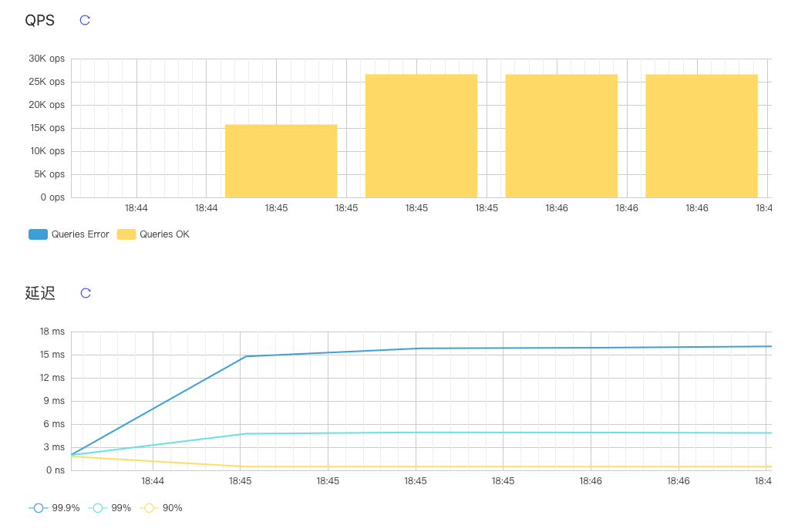
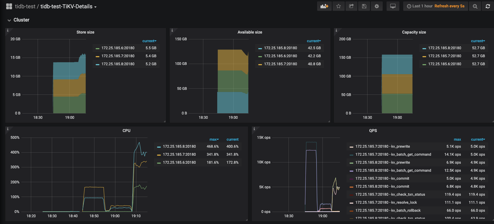
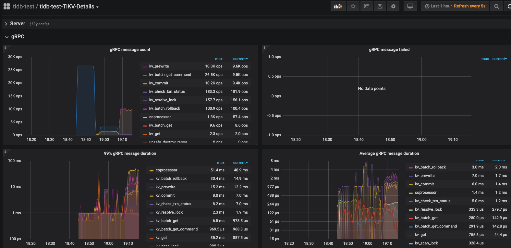

## 1.机器硬件配置

阿里云 ecs.c6.2xlarge

| 类别  | 名称                    |
| ----- | ----------------------- |
| OS    | linux / CentOS 7.5 64位 |
| CPU   | 8 vCPU                  |
| RAM   | 32GB                    |
| DISK  | 50GB                    |
| BRAND | 100 Mbps                |

## 2.集群信息

拓补信息

| 实例                     | 个数 | 物理机配置   | IP                                               | 配置                  |
| ------------------------ | ---- | ------------ | ------------------------------------------------ | --------------------- |
| TiDB                     | 3    | 8 vCPU 32 GB | 172.25.185.6、172.25.185.7、172.25.185.8（私网） | 默认端口 全局目录配置 |
| PD                       | 3    | 8 vCPU 32 GB | 172.25.185.6、172.25.185.7、172.25.185.8（私网） | 默认端口 全局目录配置 |
| TiKV                     | 3    | 8 vCPU 32 GB | 172.25.185.6、172.25.185.7、172.25.185.8（私网） | 默认端口 全局目录配置 |
| sysbench&&go-ycsb&go-tpc | 1    | 8 vCPU 16 GB | 172.25.185.12（私网）                            | 默认端口 全局目录配置 |
| Monitoring & Grafana     | 1    | 8 vCPU 32 GB | 172.25.185.7（私网）                             | 默认端口 全局目录配置 |

集群信息


## 3.TiDB 、TiKV调优配置及测试

tiup 集群基础配置

```yaml
global:
  user: "tidb"
  ssh_port: 22
  deploy_dir: "/tidb-deploy"
  data_dir: "/tidb-data"

pd_servers:
  - host: 172.25.185.7
  - host: 172.25.185.8
  - host: 172.25.185.6

tidb_servers:
  - host: 172.25.185.7
  - host: 172.25.185.8
  - host: 172.25.185.6

tikv_servers:
  - host: 172.25.185.7
  - host: 172.25.185.8
  - host: 172.25.185.6

monitoring_servers:
  - host: 172.25.185.7

grafana_servers:
  - host: 172.25.185.7

alertmanager_servers:
  - host: 172.25.185.7
```

配置调优：

 tikv配置调优

```
线程池相关：
1.Storage Read Pool 调整，读请求使用统一线程池，降低线程数量，readpool.storage.use-unified-pool=true（4.0及以后）
2.gRPC 线程池的大小调整，server.grpc-concurrency=2
3. 调整UnifyReadPool 的线程数，避免频繁的线程切换，treadpool.unified.max-thread-count = 4 (8 core)
4. Raftstore 写线程调整，raftstore.sync-log=false
其他：
 raftstore.sync-log: false
 storage.block-cache.capacity: "1GB"
 rocksdb.defaultcf.block-size: "64KB"
 rocksdb.defaultcf.write-buffer-size: "128MB"
 rocksdb.defaultcf.max-write-buffer-number: 10
 readpool.coprocessor.use-unified-pool: true
```

部署集群(使用root账户)

> tiup cluster deploy tidb-test v4.0.0 ./topology.yaml --user root 

启动集群 

> tiup cluster start tidb-test

关闭集群

> tiup cluster stop tidb-test

验证集群运行状态

> tiup cluster display tidb-test

更新配置

> tiup cluster edit-config tidb-test
>
> tiup cluster reload tidb-test

连接tidb

> mysql -u root -h 101.200.239.97 -P 4000

## 4.关键指标的监控图

Read-Only测试截图

> sysbench --config-file=config oltp_read_only --threads=128 --tables=32 --table-size=10000 run


```
SQL statistics:
    queries performed:
        read:                            2616754
        write:                           0
        other:                           373822
        total:                           2990576
    transactions:                        186911 (309.85 per sec.)
    queries:                             2990576 (4957.61 per sec.)
    ignored errors:                      0      (0.00 per sec.)
    reconnects:                          0      (0.00 per sec.)

General statistics:
    total time:                          603.2278s
    total number of events:              186911

Latency (ms):
         min:                                   61.93
         avg:                                  411.02
         max:                                 7003.17
         95th percentile:                     1013.60
         sum:                             76824454.58

Threads fairness:
    events (avg/stddev):           1460.2422/61.28
    execution time (avg/stddev):   600.1911/0.29

```


Point Select 

> sysbench --config-file=config oltp_point_select --threads=128 --tables=32 --table-size=10000 run




```

SQL statistics:
    queries performed:
        read:                            15957575
        write:                           0
        other:                           0
        total:                           15957575
    transactions:                        15957575 (26595.31 per sec.)
    queries:                             15957575 (26595.31 per sec.)
    ignored errors:                      0      (0.00 per sec.)
    reconnects:                          0      (0.00 per sec.)

General statistics:
    total time:                          600.0132s
    total number of events:              15957575

Latency (ms):
         min:                                    3.30
         avg:                                    4.81
         max:                                   75.45
         95th percentile:                        5.67
         sum:                             76795124.57

Threads fairness:
    events (avg/stddev):           124668.5547/13390.15
    execution time (avg/stddev):   599.9619/0.01

```

Update Index 测试截图

> sysbench --config-file=config oltp_update_index --threads=128 --tables=32 --table-size=10000 run






```
SQL statistics:
    queries performed:
        read:                            0
        write:                           5745269
        other:                           0
        total:                           5745269
    transactions:                        5745269 (9573.00 per sec.)
    queries:                             5745269 (9573.00 per sec.)
    ignored errors:                      0      (0.00 per sec.)
    reconnects:                          0      (0.00 per sec.)

General statistics:
    total time:                          600.1523s
    total number of events:              5745269

Latency (ms):
         min:                                    4.76
         avg:                                   13.37
         max:                                 1073.32
         95th percentile:                       24.38
         sum:                             76798982.92

Threads fairness:
    events (avg/stddev):           44884.9141/2172.06
    execution time (avg/stddev):   599.9921/0.02

```


go-ycsb

>  ./bin/go-ycsb load mysql -P workloads/workloada -p recordcount=10000 -p mysql.host=101.200.239.97 -p mysql.port=4000 --threads 128
>
>  ./bin/go-ycsb run mysql -P workloads/workloada -p recordcount=10000 -p mysql.host=101.200.239.97 -p mysql.port=4000 --threads 256

```

***************** properties *****************
"insertproportion"="0"
"readallfields"="true"
"updateproportion"="0.5"
"operationcount"="1000"
"workload"="core"
"requestdistribution"="uniform"
"recordcount"="10000"
"mysql.port"="4000"
"readproportion"="0.5"
"dotransactions"="true"
"threadcount"="256"
"scanproportion"="0"
**********************************************
Run finished, takes 1.655856322s
READ   - Takes(s): 1.6, Count: 362, OPS: 223.1, Avg(us): 23959, Min(us): 4576, Max(us): 76291, 99th(us): 69000, 99.9th(us): 77000, 99.99th(us): 77000
UPDATE - Takes(s): 1.6, Count: 405, OPS: 250.8, Avg(us): 36496, Min(us): 6038, Max(us): 85346, 99th(us): 82000, 99.9th(us): 86000, 99.99th(us): 86000


***************** properties *****************
"workload"="core"
"dotransactions"="true"
"readproportion"="0.5"
"updateproportion"="0.5"
"scanproportion"="0"
"insertproportion"="0"
"requestdistribution"="uniform"
"operationcount"="1000"
"readallfields"="true"
"recordcount"="100000"
"mysql.port"="4000"
"threadcount"="256"
**********************************************
Run finished, takes 1.654352524s
READ   - Takes(s): 1.6, Count: 389, OPS: 237.7, Avg(us): 57952, Min(us): 4326, Max(us): 158750, 99th(us): 151000, 99.9th(us): 159000, 99.99th(us): 159000
UPDATE - Takes(s): 1.6, Count: 379, OPS: 235.3, Avg(us): 67763, Min(us): 7112, Max(us): 159898, 99th(us): 153000, 99.9th(us): 160000, 99.99th(us): 160000

***************** properties *****************
"insertproportion"="0"
"recordcount"="1000000"
"mysql.port"="4000"
"workload"="core"
"operationcount"="1000"
"dotransactions"="true"
"threadcount"="256"
"readallfields"="true"
"updateproportion"="0.5"
"scanproportion"="0"
"requestdistribution"="uniform"
"readproportion"="0.5"
**********************************************
Run finished, takes 255.700502ms
READ   - Takes(s): 0.2, Count: 378, OPS: 1577.3, Avg(us): 55258, Min(us): 4852, Max(us): 168412, 99th(us): 167000, 99.9th(us): 169000, 99.99th(us): 169000
UPDATE - Takes(s): 0.2, Count: 390, OPS: 1867.9, Avg(us): 57553, Min(us): 8043, Max(us): 169168, 99th(us): 141000, 99.9th(us): 170000, 99.99th(us): 170000


```


workloadb

```
***************** properties *****************
"mysql.port"="4000"
"threadcount"="256"
"readproportion"="0.95"
"readallfields"="true"
"requestdistribution"="uniform"
"workload"="core"
"insertproportion"="0"
"dotransactions"="true"
"scanproportion"="0"
"operationcount"="1000"
"mysql.host"="101.200.121.46"
"updateproportion"="0.05"
"recordcount"="10000"
**********************************************
Run finished, takes 88.191178ms
READ   - Takes(s): 0.1, Count: 741, OPS: 9597.7, Avg(us): 15049, Min(us): 5023, Max(us): 44602, 99th(us): 37000, 99.9th(us): 45000, 99.99th(us): 45000
UPDATE - Takes(s): 0.0, Count: 27, OPS: 693.0, Avg(us): 21976, Min(us): 10381, Max(us): 38235, 99th(us): 39000, 99.9th(us): 39000, 99.99th(us): 39000

```

workloadc

```
***************** properties *****************
"workload"="core"
"insertproportion"="0"
"recordcount"="10000"
"requestdistribution"="uniform"
"mysql.port"="4000"
"scanproportion"="0"
"threadcount"="256"
"dotransactions"="true"
"updateproportion"="0"
"operationcount"="1000"
"readallfields"="true"
"readproportion"="1"
"mysql.host"="101.200.121.46"
**********************************************
Run finished, takes 1.635710259s
READ   - Takes(s): 1.6, Count: 768, OPS: 473.4, Avg(us): 12647, Min(us): 4582, Max(us): 37271, 99th(us): 34000, 99.9th(us): 38000, 99.99th(us): 38000

```

workloadd

```
***************** properties *****************
"updateproportion"="0"
"workload"="core"
"readproportion"="0.95"
"dotransactions"="true"
"threadcount"="256"
"scanproportion"="0"
"mysql.port"="4000"
"requestdistribution"="latest"
"insertproportion"="0.05"
"operationcount"="1000"
"mysql.host"="101.200.121.46"
"recordcount"="10000"
"readallfields"="true"
**********************************************
Run finished, takes 1.642859001s
INSERT - Takes(s): 1.6, Count: 46, OPS: 28.5, Avg(us): 11324, Min(us): 7251, Max(us): 16460, 99th(us): 17000, 99.9th(us): 17000, 99.99th(us): 17000
READ   - Takes(s): 1.6, Count: 722, OPS: 442.3, Avg(us): 9781, Min(us): 4298, Max(us): 26517, 99th(us): 26000, 99.9th(us): 27000, 99.99th(us): 27000

```


workloade

```
***************** properties *****************
"dotransactions"="true"
"insertproportion"="0.05"
"scanlengthdistribution"="uniform"
"mysql.host"="101.200.121.46"
"maxscanlength"="1"
"mysql.port"="4000"
"operationcount"="1000"
"updateproportion"="0"
"threadcount"="256"
"readproportion"="0"
"recordcount"="10000"
"scanproportion"="0.95"
"readallfields"="true"
"workload"="core"
"requestdistribution"="uniform"
**********************************************
Run finished, takes 1.64064701s
INSERT - Takes(s): 1.6, Count: 35, OPS: 21.9, Avg(us): 18041, Min(us): 9122, Max(us): 39857, 99th(us): 40000, 99.9th(us): 40000, 99.99th(us): 40000
SCAN   - Takes(s): 1.6, Count: 733, OPS: 451.8, Avg(us): 21992, Min(us): 5058, Max(us): 78730, 99th(us): 55000, 99.9th(us): 79000, 99.99th(us): 79000

```

workloadf

```
***************** properties *****************
"mysql.host"="101.200.121.46"
"recordcount"="10000"
"workload"="core"
"operationcount"="1000"
"readproportion"="0.5"
"mysql.port"="4000"
"readmodifywriteproportion"="0.5"
"requestdistribution"="uniform"
"threadcount"="256"
"readallfields"="true"
"dotransactions"="true"
"scanproportion"="0"
"insertproportion"="0"
"updateproportion"="0"
**********************************************
Run finished, takes 143.649124ms
READ   - Takes(s): 0.1, Count: 768, OPS: 5713.1, Avg(us): 14865, Min(us): 4514, Max(us): 32148, 99th(us): 30000, 99.9th(us): 33000, 99.99th(us): 33000
READ_MODIFY_WRITE - Takes(s): 0.1, Count: 384, OPS: 4475.6, Avg(us): 41657, Min(us): 11494, Max(us): 69718, 99th(us): 68000, 99.9th(us): 70000, 99.99th(us): 70000
UPDATE - Takes(s): 0.1, Count: 384, OPS: 4472.2, Avg(us): 26874, Min(us): 5971, Max(us): 44773, 99th(us): 45000, 99.9th(us): 45000, 99.99th(us): 45000

```


Tpc-c

> ./bin/go-tpc tpcc -H 101.200.239.97 -P 4000 -D tpcc --warehouses 20 prepare
>
> ./bin/go-tpc tpcc -H 101.200.239.97 -P 4000 -D tpcc --warehouses 20 run


Tpc-h

>  ./bin/go-tpc tpch prepare -H 101.200.239.97 -P 4000 -D tpch --sf 5 --analyze
>
>  ./bin/go-tpc tpch run -H 101.200.239.97 -P 4000 -D tpch --sf 5


查看order表的数据量

```mysql
mysql> select count(1) from orders;
+----------+
| count(1) |
+----------+
|  2272256 |
+----------+
1 row in set (0.38 sec)

```

prepare 过程中集群指标截图


tpc-h run测试开始5s后集群出现异常，centos系统运行缓慢

```
[root@tidb-bench go-tpc]# ./bin/go-tpc tpch run -H 101.200.239.97 -P 4000 -D tpch --sf 5
[Current] Q1: 3.56s
[Current] Q2: 3.20s
[Current] Q3: 2.06s
[Current] Q4: 0.97s
[mysql] 2020/08/25 11:01:37 packets.go:36: unexpected EOF
[2020-08-25 11:01:37] execute run failed, err execute query 
select
	n_name,
	sum(l_extendedprice * (1 - l_discount)) as revenue
from
	customer,
	orders,
	lineitem,
	supplier,
	nation,
	region
where
	c_custkey = o_custkey
	and l_orderkey = o_orderkey
	and l_suppkey = s_suppkey
	and c_nationkey = s_nationkey
	and s_nationkey = n_nationkey
	and n_regionkey = r_regionkey
	and r_name = 'MIDDLE EAST'
	and o_orderdate >= '1994-01-01'
	and o_orderdate < date_add('1994-01-01', interval '1' year)
group by
	n_name
order by
	revenue desc;
 failed invalid connection
execute run failed, err execute query 
select
	n_name,
	sum(l_extendedprice * (1 - l_discount)) as revenue
from
	customer,
	orders,
	lineitem,
	supplier,
	nation,
	region
where
	c_custkey = o_custkey
	and l_orderkey = o_orderkey
	and l_suppkey = s_suppkey
	and c_nationkey = s_nationkey
	and s_nationkey = n_nationkey
	and n_regionkey = r_regionkey
	and r_name = 'MIDDLE EAST'
	and o_orderdate >= '1994-01-01'
	and o_orderdate < date_add('1994-01-01', interval '1' year)
group by
	n_name
order by
	revenue desc;
 failed invalid connection
Finished
[Summary] Q1: 3.56s
[Summary] Q2: 3.20s
[Summary] Q3: 2.06s
[Summary] Q4: 0.97s

```

  此时查看集群信息出现如下日志

```
[root@TiDB102 ~]# tiup cluster display tidb-test
fatal error: runtime: out of memory

runtime stack:
runtime.throw(0xa6a0d4, 0x16)
	runtime/panic.go:774 +0x72 fp=0x7ffe629950a0 sp=0x7ffe62995070 pc=0x42da72
runtime.sysMap(0xc000000000, 0x4000000, 0xf27df8)
	runtime/mem_linux.go:169 +0xc5 fp=0x7ffe629950e0 sp=0x7ffe629950a0 pc=0x417f95
runtime.(*mheap).sysAlloc(0xf0f780, 0x2000, 0x0, 0x0)
	runtime/malloc.go:701 +0x1cd fp=0x7ffe62995188 sp=0x7ffe629950e0 pc=0x40b22d
runtime.(*mheap).grow(0xf0f780, 0x1, 0xffffffff)
	runtime/mheap.go:1252 +0x42 fp=0x7ffe629951e0 sp=0x7ffe62995188 pc=0x425f12
runtime.(*mheap).allocSpanLocked(0xf0f780, 0x1, 0xf27e08, 0x0)
	runtime/mheap.go:1163 +0x291 fp=0x7ffe62995260 sp=0x7ffe629951e0 pc=0x425e01
runtime.(*mheap).alloc_m(0xf0f780, 0x1, 0x2a, 0x0)
	runtime/mheap.go:1015 +0xc2 fp=0x7ffe629952b0 sp=0x7ffe62995260 pc=0x425672
runtime.(*mheap).alloc.func1()
	runtime/mheap.go:1086 +0x4c fp=0x7ffe629952e8 sp=0x7ffe629952b0 pc=0x4565ac
runtime.(*mheap).alloc(0xf0f780, 0x1, 0x1002a, 0x0)
	runtime/mheap.go:1085 +0x8a fp=0x7ffe62995338 sp=0x7ffe629952e8 pc=0x42595a
runtime.(*mcentral).grow(0xf105a0, 0x0)
	runtime/mcentral.go:255 +0x7b fp=0x7ffe62995378 sp=0x7ffe62995338 pc=0x4179bb
runtime.(*mcentral).cacheSpan(0xf105a0, 0x7f014884f000)
	runtime/mcentral.go:106 +0x2fe fp=0x7ffe629953d8 sp=0x7ffe62995378 pc=0x4174de
runtime.(*mcache).refill(0x7f014884f008, 0x2a)
	runtime/mcache.go:138 +0x85 fp=0x7ffe629953f8 sp=0x7ffe629953d8 pc=0x416f85
runtime.(*mcache).nextFree(0x7f014884f008, 0xf27e2a, 0x7f014884f008, 0x8, 0xfffffffffffffff8)
	runtime/malloc.go:854 +0x87 fp=0x7ffe62995430 sp=0x7ffe629953f8 pc=0x40ba57
runtime.mallocgc(0x180, 0xa5c120, 0x1, 0xf27e60)
	runtime/malloc.go:1022 +0x793 fp=0x7ffe629954d0 sp=0x7ffe62995430 pc=0x40c393
runtime.newobject(0xa5c120, 0x4000)
	runtime/malloc.go:1151 +0x38 fp=0x7ffe62995500 sp=0x7ffe629954d0 pc=0x40c788
runtime.malg(0xb5d00008000, 0xf11e10)
	runtime/proc.go:3232 +0x31 fp=0x7ffe62995540 sp=0x7ffe62995500 pc=0x436e11
runtime.mpreinit(...)
	runtime/os_linux.go:324
runtime.mcommoninit(0xf0a240)
	runtime/proc.go:626 +0xc2 fp=0x7ffe62995578 sp=0x7ffe62995540 pc=0x430832
runtime.schedinit()
	runtime/proc.go:543 +0x72 fp=0x7ffe629955d0 sp=0x7ffe62995578 pc=0x430492
runtime.rt0_go(0x7ffe62995608, 0x4, 0x7ffe62995608, 0x0, 0x0, 0x4, 0x7ffe62996856, 0x7ffe6299685b, 0x7ffe62996863, 0x7ffe6299686b, ...)
	runtime/asm_amd64.s:214 +0x125 fp=0x7ffe629955d8 sp=0x7ffe629955d0 pc=0x458975

```

重启阿里云服务器后再次启动tidb集群测试，关键指标截图


## 5.负载分析

本次测试使用三台8 vCPU 32 GiB服务器，服务配置参考拓补信息，测试过程中发现单节点Cpu使用率过高（考虑后面使用HAProxy）,如下图


随着测试的持续进行，各个节点的cpu使用率趋于均衡。

此外在进行Update Index 测试时，TiDB 节点陆续挂掉


报错节点相关日志：

https://github.com/jingdq/High-Performance-TiDB-HomeWork/blob/master/week2/tidb_172_25_185_6_4000.log

https://github.com/jingdq/High-Performance-TiDB-HomeWork/blob/master/week2/tidb_172_25_185_7_4000.log

https://github.com/jingdq/High-Performance-TiDB-HomeWork/blob/master/week2/tidb_172_25_185_8_4000.log

https://github.com/jingdq/High-Performance-TiDB-HomeWork/blob/master/week2/tikv_172_25_185_8_20160.log

错误完整日志：

https://github.com/jingdq/High-Performance-TiDB-HomeWork/blob/master/week2/tidb_error_logs.tar

## 6.性能瓶颈分析

集群信息


主机信息


测试脚本

```shell

sysbench --config-file=config oltp_read_only --threads=128 --tables=32 --table-size=10000 run

sysbench --config-file=config oltp_point_select --threads=128 --tables=32 --table-size=10000 run

sysbench --config-file=config oltp_update_index --threads=128 --tables=32 --table-size=10000 run

bin/go-ycsb run mysql -P workloads/workloada -p recordcount=10000 -p mysql.host=101.200.121.46 -p mysql.port=4000 --threads 256

bin/go-tpc tpcc -H 101.200.121.46 -P 4000 -D tpcc --warehouses 20 run

bin/go-tpc tpch run -H 101.200.121.46 -P 4000 -D tpch --sf 5
```

在以上的硬件环境，拓扑配置及workload 下，从测试的表现来看 ,Update Index操作时瓶颈在于 TiDB组件，测试过程中集群中tidb节点服务down掉，tiup重启集群后再次测试可以通过,go-tpc tpch 测试时 瓶颈在于集群硬件资源。

具体技术问题需要自己逐步熟悉TiDB技术栈后深分析，暂且给出如上分析。

## 参考文章

TPC-C 基准性能测试

https://github.com/pingcap-incubator/tidb-in-action/blob/master/session4/chapter3/tpc-c.md

tidb性能调优

**https://docs.pingcap.com/zh/tidb/stable/configure-memory-usage**

tidb配置文件

https://docs.pingcap.com/zh/tidb/stable/tidb-configuration-file

tiup 配置:https://github.com/pingcap/tiup/blob/master/examples/topology.example.yaml

tiup详细使用：https://github.com/pingcap/tiup/blob/master/doc/user/cluster.md

TiDB配置:

 https://pingcap.com/docs/stable/reference/configuration/tidb-server/configuration-file/

https://www.bookstack.cn/read/TiDB-4.0/tidb-configuration-file.md

TiKV配置:

 https://pingcap.com/docs/stable/reference/configuration/tikv-server/configuration-file/

 https://www.bookstack.cn/read/TiDB-4.0/tikv-configuration-file.md

PD配置:

 https://pingcap.com/docs/stable/reference/configuration/pd-server/configuration-file/

https://www.bookstack.cn/read/TiDB-4.0/pd-configuration-file.md

TiUP bench ：https://www.bookstack.cn/read/TiDB-4.0/tiup-tiup-bench.md

TiDB监控指标：[https://www.bookstack.cn/read/TiDB-4.0/%E7%9B%91%E6%8E%A7%E6%8C%87%E6%A0%87.md](https://www.bookstack.cn/read/TiDB-4.0/监控指标.md)

TiKV线程池调优：https://www.bookstack.cn/read/TiDB-4.0/tune-tikv-thread-performance.md

TiKV内存调优：https://www.bookstack.cn/read/TiDB-4.0/tune-tikv-memory-performance.md


